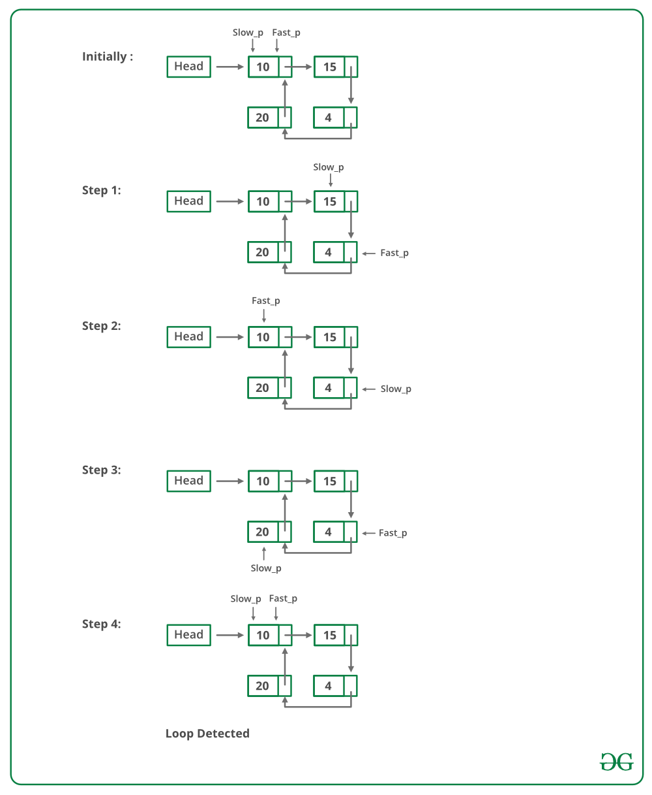

# Floyd's Cycle Detection Algorithm
- The algorithm detects loop in linked list if there is. In here algorithm will be explained basically. If you want to reach source code of algorithm which is written with C programming language, you can click [here](https://github.com/MertPehlivancik/Data-Structures-and-Algorithms/tree/main/Data%20Structures/LinkedList) and download linked list source code. After that you can call "linked_list_detect_loop_with_FloydCycleFindingAlgorithm" function.
- If you preper, you can read this document at [Turkish](Readme.tr.md).

## Explanation

Source of imagine is (https://www.geeksforgeeks.org/detect-loop-in-a-linked-list/)

Firstly, two pointer should be defined. One of these is fast pointer and other one is slow pointer. If fast pointer and slow pointer meet at same pointer, there is a loop in this linked list. Above imagine shows us this scenario which was mentioned.

